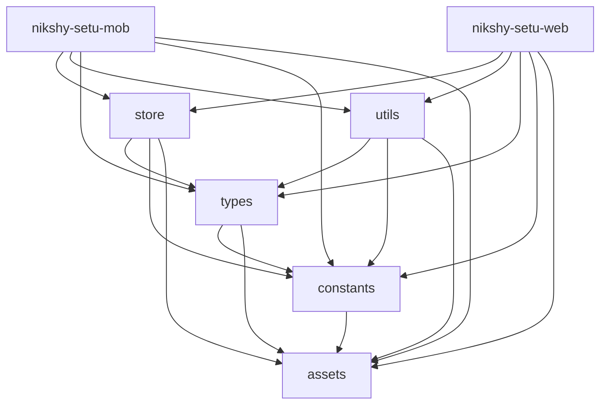

<p align="center">
  
</p>

<p align="center">
  <a href="https://nikshay-setu.in/" target="_blank">
    
  </a>
</p>

<div align="center">


</div>

## Ni-kshay Setu | Support to End Tuberculosis

The Ni-kshay Setu app ([https://nikshay-setu.in/](https://nikshay-setu.in/)), already with **44K+ subscribers**, empowers healthcare providers to make informed decisions and contributes to India's mission to combat tuberculosis. Available on [web](https://nikshay-setu.in/), [Android](https://play.google.com/store/apps/details?id=com.iiphg.tbapp&pli=1) , and [iOS](https://apps.apple.com/in/app/ni-kshay-setu/id1631331386) platforms in 8 languages, it offers real-time updates, interactive modules, and personalized insights, revolutionizing TB knowledge management and accessibility across India.


## Table of Contents

- [Project Overview](#project-overview)
- [Features](#features)
- [Tech Stack](#tech-stack)
- [Setup Instructions](#setup-instructions)
- [Conventional Branching](#conventional-branching)
- [Conventional Commits](#conventional-commits)
- [Contribution Guidelines](#contribution-guidelines)
- [License](#license)

## Introduction

Ni-kshay Setu is a groundbreaking digital solution available as a web application, Android application, and iOS application. With a mission to support healthcare providers in decision-making and transform knowledge into empowerment, this innovative and interactive learning tool is a catalyst in India's journey towards a TB-free nation. As a comprehensive digital platform, Ni-kshay Setu revolutionizes the way healthcare providers approach TB management. By leveraging cutting-edge technology, it empowers medical professionals with real-time support and evidence-based recommendations, ensuring they have the most up-to-date information at their fingertips. With an intuitive interface and user-friendly design, Ni-kshay Setu offers a seamless experience across devices, making it accessible to a wide range of users. The web application allows healthcare providers to access the platform from any computer, while the Android and iOS applications provide mobility and convenience for on-the-go professionals. Through a range of interactive modules, virtual simulations, and case studies, Ni-kshay Setu transforms learning into a dynamic and engaging experience. Healthcare providers can enhance their knowledge and skills by practicing TB case management in a risk-free environment. They can diagnose, prescribe treatment plans, and monitor patient progress, gaining invaluable experience and building their confidence in TB management.

> The Ni-kshay Setu app is part of the 'Closing the Gaps in TB care Cascade (CGC)' project, developed by the Indian Institute of Public Health, Gandhinagar (https://iiphg.edu.in/). This project aims to strengthen health systems' ability to comprehensively monitor and respond to the TB care cascade with quality improvement (QI) interventions. This digital solution is one of the key interventions of the project with the objectives to strengthen the knowledge support system of the health staff in TB patient-centric care and program management of the National TB Elimination Program.

> Technological support for this project is provided by Digiflux Technologies Pvt. Ltd. (https://www.digiflux.io), contributing to the development and implementation of the digital solution.

## 2. Features

- **Subscriber Monitoring:** Keep track of Ni-kshay SETU subscribers' progress and activities.
- **Data Visualization:** Visualize data in a user-friendly way for easy analysis, making it simpler to understand complex information.
- **Module Management:** Create and manage various modules, including Diagnosis, Treatment, and other types of content to tailor the platform to your needs.
- **Assessment Creation:** Develop and manage assessments for all subscribers or specific groups, allowing for better evaluation and customization. This can also be done at each state/district levels for their respective programs.
- **Material and Document Management:** Organize and provide access to materials and documents for subscribers, ensuring they have the necessary resources.
- **Leaderboard Progress:** Monitor subscribers' progress using leaderboard parameters, encouraging healthy competition and motivation.
- **Notification System:** Implement a notification system to alert and remind subscribers about important information and activities.
- **Roles and Permissions:** Manage roles and permissions for State and District level administrators to maintain control and security.
- **Master Data Management:** Oversee master data such as states, districts, health facilities, and cadres to ensure accuracy and consistency in the system.
- **Automatic News Feed:** Incorporate an automated news feed from various sources, keeping subscribers informed and updated on relevant news and developments.
- **Central Government Applications:** Add relevant applications related to government programs, enhancing the platform's utility and functionality.
- **Multilingual Support:** Control and manage multiple language support directly from the admin panel, making it easier to serve a diverse user base.
- **Chatbot and Machine Learning:** Manage and control the chatbot, machine learning, and data modeling features, offering users an interactive and intelligent experience within the platform.
- **Managing Health Facilities for T.B. :** Efficiently manage healthcare facilities within the platform, complete with configurable locations (State, District, Village, City including Latitude Longitude) and details about the services available at each location.
- **Knowledge Connect :** Provides NTEP learning courses tailored to the user's cadre.
- **Manage-TB:** Allows users to generate a prescription and share it via WhatsApp, Email, or download it directly for easy access and sharing with patients.

## 3. Technologies Used

- **Frontend:** React, Redux, TypeScript,React-Native
- **Backend:** Node.js, Express, MongoDB
- **Authentication:** NextAuth.js with Google provider integration
- **State Management:** Redux (without @reduxjs/toolkit)
- **Testing:** Jest, React Testing Library

## Setup Instructions

### Install Node version v20

Make sure you have Node.js version 20 installed. You can verify your Node.js version by running:

```bash

node -v

```

### Installation

1. **Clone the repository:**

```bash

- git clone <repository_url>
- cd <project_directory>

```

2. **Install dependencies:**

```bash

npm install

```

3. **Set up environment variables:**

Create a `.env` file in the root directory and add the necessary environment variables as specified in the `.env.example` file.
add google-services.json and GoogleService-Info.plist to use notifications

4. **Run the development For Android or ios:**

```bash
npx nx run nikshy-setu-mob:start
```

5. **Run the development For Web:**

```bash
npx nx run nikshy-setu-web:serve
```

6. **Build android-AAB :**

```bash
npm run build-bundle
```

7. **Build android project:**

```bash
npm run build-android
```

8. **Build web project:**

```bash
npm run build-web
```

## Conventional Branching

We follow a conventional branching strategy to maintain a clean and organized repository:

- **main:** The production-ready code.
- **develop:** The development branch where features are integrated.
- **feature/feature-name:** Branches for new features.
- **bugfix/bugfix-name:** Branches for bug fixes.
- **hotfix/hotfix-name:** Branches for urgent fixes on production.

## Conventional Commits

We use Conventional Commits to provide a consistent commit history:

- **feat:** A new feature.
- **fix:** A bug fix.
- **docs:** Documentation only changes.
- **style:** Changes that do not affect the meaning of the code (white-space, formatting, missing semi-colons, etc).
- **refactor:** A code change that neither fixes a bug nor adds a feature.
- **perf:** A code change that improves performance.
- **test:** Adding missing or correcting existing tests.
- **chore:** Changes to the build process or auxiliary tools and libraries such as documentation generation.

Example:

```bash

git  commit  -m  "feat: add new user authentication flow"

```

## Folder Structure

This repository contains the source code for the Nikshay Setu mobile and web applications. It is organized as a monorepo using [Yarn Workspaces](https://yarnpkg.com/features/workspaces).

## Packages

The following packages are included in this monorepo:

# Monorepo Packages

This monorepo contains the following packages:

## Apps

- **[nikshy-setu-mob](./apps/nikshy-setu-mob)**: The React Native codebase for the Nikshy Setu mobile app.
- **[nikshy-setu-web](./apps/nikshy-setu-web)**: The React codebase for the Nikshy Setu web app.

## Shared Folders

- **[store](./shared/store)**: Shared state management logic using Redux.
- **[types](./shared/types)**: Shared TypeScript types used across packages.
- **[constants](./shared/constants)**: Shared constants used across packages.
- **[assets](./shared/assets)**: Shared assets like images, icons, and fonts.
- **[utils](./shared/utils)**: Shared utility functions used across packages.

## Monorepo Dependency Graph



## Third Party Documentation

```
1. Wati - https://docs.wati.io/reference/introduction
2. Mail - https://www.twilio.com/docs/sendgrid
3. Firebase - https://www.npmjs.com/package/firebase-admin
4. TextLocal - https://api.textlocal.in/docs/
5. Nest Js - https://docs.nestjs.com/
```

## License

Ni-kshay Setu project is licensed under the [GNU General Public License, Version 3.0](https://www.gnu.org/licenses/gpl-3.0).


