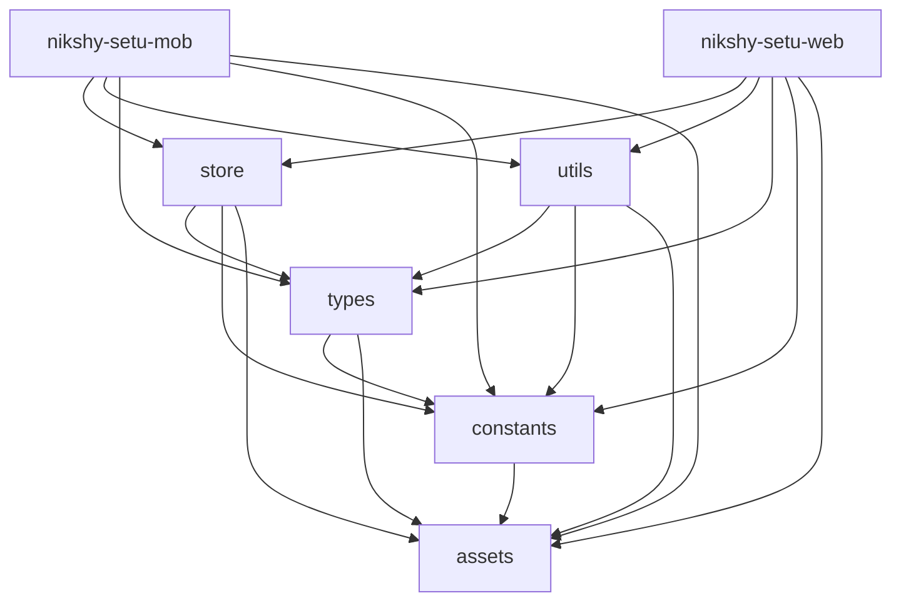

<p align="center">
  
</p>

<p align="center">
  <a href="https://nikshay-setu.in/" target="_blank">
    
  </a>
</p>

<div align="center">


</div>

## Ni-kshay Setu | Support to End Tuberculosis

The Ni-kshay Setu app ([https://nikshay-setu.in/](https://nikshay-setu.in/)), already with **44K+ subscribers**, empowers healthcare providers to make informed decisions and contributes to India's mission to combat tuberculosis. Available on [web](https://nikshay-setu.in/), [Android](https://play.google.com/store/apps/details?id=com.iiphg.tbapp&pli=1), and [iOS](https://apps.apple.com/in/app/ni-kshay-setu/id1631331386) platforms in 8 languages, it offers real-time updates, interactive modules, and personalized insights, revolutionizing TB knowledge management and accessibility across India.

## Table of Contents

- [Introduction](#introduction)
- [Features](#features)
- [Tech Stack](#tech-stack)
- [Setup Instructions](#setup-instructions)
  - [Install Node version v20](#install-node-version-v20)
  - [Installation](#installation)
    - [Clone the repository](#clone-the-repository)
    - [Install dependencies](#install-dependencies)
    - [Set up environment variables](#set-up-environment-variables)
    - [Run development (Android/iOS)](#run-development-androidios)
    - [Run development (Web)](#run-development-web)
    - [Build Android AAB](#build-android-aab)
    - [Build Android project](#build-android-project)
    - [Build Web project](#build-web-project)
- [Conventional Branching](#conventional-branching)
- [Conventional Commits](#conventional-commits)
- [Folder Structure](#folder-structure)
  - [Apps](#apps)
  - [Shared Folders](#shared-folders)
  - [Dependency Graph](#dependency-graph)
- [Third-Party Documentation](#third-party-documentation)
- [Links](#links)
- [License](#license)


## Introduction

Ni-kshay Setu is a groundbreaking digital solution available as a web application, Android application, and iOS application. With a mission to support healthcare providers in decision-making and transform knowledge into empowerment, this innovative and interactive learning tool is a catalyst in India's journey towards a TB-free nation.

As a comprehensive digital platform, Ni-kshay Setu revolutionizes the way healthcare providers approach TB management. By leveraging cutting-edge technology, it empowers medical professionals with real-time support and evidence-based recommendations, ensuring they have the most up-to-date information at their fingertips.

With an intuitive interface and user-friendly design, Ni-kshay Setu offers a seamless experience across devices, making it accessible to a wide range of users. The web application allows healthcare providers to access the platform from any computer, while the Android and iOS applications provide mobility and convenience for on-the-go professionals.

Through a range of interactive modules, virtual simulations, and case studies, Ni-kshay Setu transforms learning into a dynamic and engaging experience. Healthcare providers can enhance their knowledge and skills by practicing TB case management in a risk-free environment. They can diagnose, prescribe treatment plans, and monitor patient progress, gaining invaluable experience and building their confidence in TB management.

> The Ni-kshay Setu app is part of the 'Closing the Gaps in TB care Cascade (CGC)' project, developed by the Indian Institute of Public Health, Gandhinagar (https://iiphg.edu.in/). This project aims to strengthen health systems' ability to comprehensively monitor and respond to the TB care cascade with quality improvement (QI) interventions. This digital solution is one of the key interventions of the project with the objectives to strengthen the knowledge support system of the health staff in TB patient-centric care and program management of the National TB Elimination Program.

> Technological support for this project is provided by Digiflux Technologies Pvt. Ltd. (https://www.digiflux.io), contributing to the development and implementation of the digital solution.

## Features

- **Subscriber Monitoring:** Keep track of Ni-kshay SETU subscribers' progress and activities.
- **Data Visualization:** Visualize data in a user-friendly way for easy analysis.
- **Module Management:** Create and manage various modules like Diagnosis, Treatment, etc.
- **Assessment Creation:** Develop and manage assessments, including state/district-level customization.
- **Material and Document Management:** Provide access to essential resources.
- **Leaderboard Progress:** Track progress using leaderboard parameters.
- **Notification System:** Alert subscribers about important updates.
- **Roles and Permissions:** Manage admin roles at state/district levels.
- **Master Data Management:** Manage data like states, districts, health facilities, and cadres.
- **Automatic News Feed:** Keep users updated with automated news feeds.
- **Central Government Applications:** Integrate government program applications.
- **Multilingual Support:** Manage multiple languages from the admin panel.
- **Chatbot and Machine Learning:** Provide interactive, intelligent user experiences.
- **Managing Health Facilities for TB:** Configure healthcare facility data, including location and services.
- **Knowledge Connect:** Offer NTEP learning courses by cadre.
- **Manage-TB:** Generate and share prescriptions via WhatsApp, Email, or direct download.

## Tech Stack

- **Frontend:** React, Redux, TypeScript, React Native
- **Backend:** Node.js, Express, MongoDB
- **Authentication:** NextAuth.js with Google integration
- **State Management:** Redux (without @reduxjs/toolkit)
- **Testing:** Jest, React Testing Library

## Setup Instructions

### Install Node version v20

```bash
node -v
```

### Installation

1. **Clone the repository:**

```bash
git clone <repository_url>
cd <project_directory>
```

2. **Install dependencies:**

```bash
npm install
```

3. **Set up environment variables:**

Create a `.env` file in the root directory and copy values from `.env.example`.
Also add `google-services.json` and `GoogleService-Info.plist` for notifications.

4. **Run development (Android/iOS):**

```bash
npx nx run nikshy-setu-mob:start
```

5. **Run development (Web):**

```bash
npx nx run nikshy-setu-web:serve
```

6. **Build Android AAB:** (To make a production build, ensure the `nikshay_setu_prod.keystore` file is present.)
```bash
npm run build-bundle
```

7. **Build Android project:**

```bash
npm run build-android
```

8. **Build Web project:**

```bash
npm run build-web
```

## Conventional Branching

- `main`: Production-ready code
- `develop`: Integration branch
- `feature/feature-name`: New features
- `bugfix/bugfix-name`: Bug fixes
- `hotfix/hotfix-name`: Urgent production fixes

## Conventional Commits

- **feat:** New feature
- **fix:** Bug fix
- **docs:** Documentation updates
- **style:** Code style changes (no logic impact)
- **refactor:** Code refactoring
- **perf:** Performance improvements
- **test:** Adding or updating tests
- **chore:** Build process or tool updates

Example:

```bash
git commit -m "feat: add new user authentication flow"
```

## Folder Structure

Monorepo using [NX Workspaces](https://nx.dev/).

### Apps

- **[nikshy-setu-mob](./apps/nikshy-setu-mob)**: React Native mobile app
- **[nikshy-setu-web](./apps/nikshy-setu-web)**: React web app

### Shared Folders

- **[store](./shared/store)**: Redux state management
- **[types](./shared/types)**: TypeScript types
- **[constants](./shared/constants)**: App constants
- **[assets](./shared/assets)**: Shared images, icons, fonts
- **[utils](./shared/utils)**: Utility functions

### Dependency Graph



## Third-Party Documentation

```
1. Wati - https://docs.wati.io/reference/introduction
2. Mail (Twilio SendGrid) - https://www.twilio.com/docs/sendgrid
3. Firebase - https://www.npmjs.com/package/firebase-admin
4. TextLocal - https://api.textlocal.in/docs/
```

## Links

* [BACKEND](https://nikshay-setu.in/)
* [PYTHON](https://nikshay-setu.in/)
* [ADMIN](https://nikshay-setu.in/)

## License

Ni-kshay Setu project is licensed under the [GNU General Public License, Version 3.0](https://www.gnu.org/licenses/gpl-3.0).


